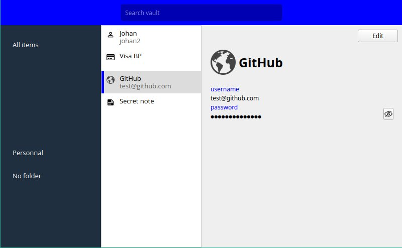

# BWD

Bwd is an unofficial [Bitwarden](https://bitwarden.com/) cross-platform desktop client.

It is merely a Proof-Of-Concept I made while reviewing Bitwarden's client [implementation](https://github.com/bitwarden/clients/).
More information [here](https://xarkes.com/b/bitwarden-code-review.html).

> [!WARNING]  
> This is just a Proof-Of-Concept, it should not be used against a real database for multiple reasons:
>   - The code is not mature **at all**
>   - The code is not tested
>   - All features are not implemented
> 
> Using it on a real database could lead to database corruption.



## Building

You need to have installed:

- cmake
- a working C++ compiler
- Qt libraries

You can compile it with the following commands:

```sh
cmake -Bbuild -DCMAKE_EXPORT_COMPILE_COMMANDS=ON -DCMAKE_CXX_COMPILER=clang++ -DCMAKE_BUILD_TYPE=Release
cmake --build build

# Run it
./build/bwd
```
